## 前言

最近在公司搭建了一个 CDH 测试环境集群，从官网得知 CDH 在 6.3.3 版本开始不再提供免费版本了，于是选择了 6.2.x 版本进行安装，这里记录一下正确的`离线安装`步骤，避免下次安装时又踩坑。

<!--more-->

## CM 和 CDH 简介

在安装之前先要理清一下 CM(Cloudera Manager)和 CDH(Cloudera Distribution Hadoop)的区别。

- CDH
  CDH 是由 Cloudera 公司发行的一套 hadoop 软件包，里面包含了`hadoop、hdfs、yarn、hive、spark`等等一系列`稳定的`、`版本兼容的`大数据套件。
- CM
  CM 也是 Cloudera 公司开发的一套用于管理和监控 CDH 集群的软件，只要通过 CM 提供的 web 管理页面操作就可以轻松的管理和监控 CDH 集群环境。
  当然也可以手动使用 CDH 来搭建集群，在服务器数量较少的情况下还可以接受，但是试想下如果集群有上百台或上千台机器，每个机器都手动安装，这是人做的事吗？

## 安装前准备

### 服务器

准备好 N 台服务器，我这里用了 3 台机器，分别如下：

| IP              | CPU  | 内存 | 硬盘 | 系统    |
| --------------- | ---- | ---- | ---- | ------- |
| 192.168.200.135 | 4 核 | 16G  | 50G  | CentOS7 |
| 192.168.200.136 | 4 核 | 16G  | 50G  | CentOS7 |
| 192.168.200.137 | 4 核 | 16G  | 50G  | CentOS7 |

`注`：所有机器的 root 用户登录密码要保持一致

### 域名设置

为三台机器设置好对应的域名，并在`hosts`中做好对应的 IP 解析。

| IP              | 域名       |
| --------------- | ---------- |
| 192.168.200.135 | master.cdh |
| 192.168.200.136 | node1.cdh  |
| 192.168.200.137 | node2.cdh  |

修改所有机器的`/etc/hosts`文件，在后面加入以下内容：

```
192.168.200.135 master.cdh
192.168.200.136 node1.cdh
192.168.200.137 node2.cdh
```

分别设置机器的主机名，执行以下命令

- 192.168.200.135
  ```
  hostnamectl set-hostname master.cdh
  ```
- 192.168.200.136
  ```
  hostnamectl set-hostname node1.cdh
  ```
- 192.168.200.137
  ```
  hostnamectl set-hostname node2.cdh
  ```

### 关闭防火墙和 SELinux

关闭所有机器的防火墙和 SELinux，执行以下命令：

- 关闭防火墙
  ```
  systemctl stop firewalld
  systemctl disable firewalld
  ```
- 关闭 SELinux
  编辑`/etc/selinux/config`文件，将`SELINUX=enforcing`修改为`SELINUX=permissive`。
  执行命令`setenforce 0`临时生效，或者重启机器永久生效。

### 搭建本地 yum 源

在`master`节点上搭建本地源用于离线安装`CM`

- 使用`httpd`作为本地源服务
  ```
  yum install -y httpd
  systemctl start httpd
  ```
- 下载 CM 离线包

  ```
  wget https://archive.cloudera.com/cm6/6.2.1/repo-as-tarball/cm6.2.1-redhat7.tar.gz
  ```

  下载慢的话可以用`ProxeeDown`或者`IDM`这类高并发下载器进行下载，再复制到`master`节点。
  还是下载不动的话只能挂梯子下了。

- 解压到对应目录

  ```
  mkdir -p /var/www/html/cloudera-repos/cm6
  tar xvfz cm6.2.1-redhat7.tar.gz -C /var/www/html/cloudera-repos/cm6 --strip-components=1
  ```

- 验证
  浏览器访问`http://master.cdh/cloudera-repos/cm6`，安装成功的话可以看到下图：
  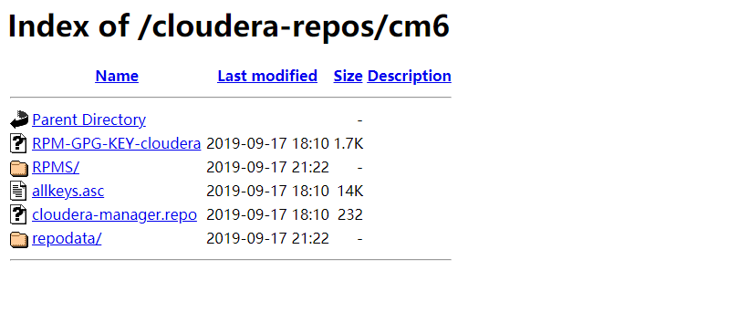

- 源配置
  只需要在`master.cdh`节点上配置即可

  ```
  touch vi /etc/yum.repos.d/cloudera-repo.repo
  ```

  在文件中写入以下内容：

  ```
  [cloudera-repo]
  name=cloudera-repo
  baseurl=http://master.cdh/cloudera-repos/cm6
  enabled=1
  gpgcheck=0
  ```

### 安装 JDK

在`所有机器`上安装好 jdk，这里我安装的是`openjdk1.8`

```
yum install -y java-1.8.0-openjdk-devel
```

### 安装 CM

在`master`节点安装 CM

```
yum install -y cloudera-manager-daemons cloudera-manager-agent cloudera-manager-server
```

之前配置好了本地 yum 源，现在通过 yum 安装 CM 会非常的快，直接使用本地的包


### 安装 MariaDB

在`master`节点上安装一个数据库，这里我安装的是`MariaDB`

```
yum install -y mariadb-server
```

修改数据库配置文件`/etc/my.cnf`，使用官方提供的配置进行替换：

```
[mysqld]
datadir=/var/lib/mysql
socket=/var/lib/mysql/mysql.sock
transaction-isolation = READ-COMMITTED
# Disabling symbolic-links is recommended to prevent assorted security risks;
# to do so, uncomment this line:
symbolic-links = 0
# Settings user and group are ignored when systemd is used.
# If you need to run mysqld under a different user or group,
# customize your systemd unit file for mariadb according to the
# instructions in http://fedoraproject.org/wiki/Systemd

key_buffer = 16M
key_buffer_size = 32M
max_allowed_packet = 32M
thread_stack = 256K
thread_cache_size = 64
query_cache_limit = 8M
query_cache_size = 64M
query_cache_type = 1

max_connections = 550
#expire_logs_days = 10
#max_binlog_size = 100M

#log_bin should be on a disk with enough free space.
#Replace '/var/lib/mysql/mysql_binary_log' with an appropriate path for your
#system and chown the specified folder to the mysql user.
log_bin=/var/lib/mysql/mysql_binary_log

#In later versions of MariaDB, if you enable the binary log and do not set
#a server_id, MariaDB will not start. The server_id must be unique within
#the replicating group.
server_id=1

binlog_format = mixed

read_buffer_size = 2M
read_rnd_buffer_size = 16M
sort_buffer_size = 8M
join_buffer_size = 8M

# InnoDB settings
innodb_file_per_table = 1
innodb_flush_log_at_trx_commit  = 2
innodb_log_buffer_size = 64M
innodb_buffer_pool_size = 4G
innodb_thread_concurrency = 8
innodb_flush_method = O_DIRECT
innodb_log_file_size = 512M

[mysqld_safe]
log-error=/var/log/mariadb/mariadb.log
pid-file=/var/run/mariadb/mariadb.pid

#
# include all files from the config directory
#
!includedir /etc/my.cnf.d
```

启动数据库

```
systemctl start mariadb
systemctl enable mariadb
```

初始化数据库

```
/usr/bin/mysql_secure_installatio
```

初始化`root`用户密码和其它一些选项

```
[...]
Enter current password for root (enter for none):
OK, successfully used password, moving on...
[...]
Set root password? [Y/n] Y
New password:
Re-enter new password:
[...]
Remove anonymous users? [Y/n] Y
[...]
Disallow root login remotely? [Y/n] N
[...]
Remove test database and access to it [Y/n] Y
[...]
Reload privilege tables now? [Y/n] Y
[...]
All done!  If you've completed all of the above steps, your MariaDB
installation should now be secure.

Thanks for using MariaDB!
```

### 下载 jdbc 驱动

在`master`节点上下载，因为 Maria 兼容 MySql ，所以直接下载 mysql 的 jdbc 驱动就行

```
wget https://dev.mysql.com/get/Downloads/Connector-J/mysql-connector-java-5.1.46.tar.gz
mkdir -p /usr/share/java/
cp mysql-connector-java-5.1.46/mysql-connector-java-5.1.46-bin.jar /usr/share/java/mysql-connector-java.jar
```

### 创建数据库

登录 DB 并创建对应的数据库和用户，用于后续 CM 程序使用

```
mysql -u root -p
```

执行语句

```
CREATE DATABASE scm DEFAULT CHARACTER SET utf8 DEFAULT COLLATE utf8_general_ci;
GRANT ALL ON scm.* TO 'scm'@'%' IDENTIFIED BY '123456';
CREATE DATABASE amon DEFAULT CHARACTER SET utf8 DEFAULT COLLATE utf8_general_ci;
GRANT ALL ON amon.* TO 'amon'@'%' IDENTIFIED BY '123456';
CREATE DATABASE rman DEFAULT CHARACTER SET utf8 DEFAULT COLLATE utf8_general_ci;
GRANT ALL ON rman.* TO 'rman'@'%' IDENTIFIED BY '123456';
CREATE DATABASE hue DEFAULT CHARACTER SET utf8 DEFAULT COLLATE utf8_general_ci;
GRANT ALL ON hue.* TO 'hue'@'%' IDENTIFIED BY '123456';
CREATE DATABASE metastore DEFAULT CHARACTER SET utf8 DEFAULT COLLATE utf8_general_ci;
GRANT ALL ON metastore.* TO 'hive'@'%' IDENTIFIED BY '123456';
CREATE DATABASE sentry DEFAULT CHARACTER SET utf8 DEFAULT COLLATE utf8_general_ci;
GRANT ALL ON sentry.* TO 'sentry'@'%' IDENTIFIED BY '123456';
CREATE DATABASE nav DEFAULT CHARACTER SET utf8 DEFAULT COLLATE utf8_general_ci;
GRANT ALL ON nav.* TO 'nav'@'%' IDENTIFIED BY '123456';
CREATE DATABASE navms DEFAULT CHARACTER SET utf8 DEFAULT COLLATE utf8_general_ci;
GRANT ALL ON navms.* TO 'navms'@'%' IDENTIFIED BY '123456';
CREATE DATABASE oozie DEFAULT CHARACTER SET utf8 DEFAULT COLLATE utf8_general_ci;
GRANT ALL ON oozie.* TO 'oozie'@'%' IDENTIFIED BY '123456';

```

确认是否创建成功

```
MariaDB [(none)]> SHOW DATABASES;
+--------------------+
| Database           |
+--------------------+
| information_schema |
| amon               |
| hue                |
| metastore          |
| mysql              |
| nav                |
| navms              |
| oozie              |
| performance_schema |
| rman               |
| scm                |
| sentry             |
+--------------------+
```

### 设置 CM 数据库

官方提供了一个脚本用于初始化 CM 相关的数据，执行如下命令：

```
/opt/cloudera/cm/schema/scm_prepare_database.sh mysql scm scm
```

执行完成

```
/opt/cloudera/cm/schema/scm_prepare_database.sh mysql scm scm
Enter SCM password:
JAVA_HOME=/usr/lib/jvm/java-openjdk
Verifying that we can write to /etc/cloudera-scm-server
Creating SCM configuration file in /etc/cloudera-scm-server
Executing:  /usr/lib/jvm/java-openjdk/bin/java -cp /usr/share/java/mysql-connector-java.jar:/usr/share/java/oracle-connector-java.jar:/usr/share/java/postgresql-connector-java.jar:/opt/cloudera/cm/schema/../lib/* com.cloudera.enterprise.dbutil.DbCommandExecutor /etc/cloudera-scm-server/db.properties com.cloudera.cmf.db.
[                          main] DbCommandExecutor              INFO  Successfully connected to database.
All done, your SCM database is configured correctly!
```

### 下载 CDH 离线包

这里要注意的是，根据不同的操作系统需要下载对应的包，浏览器访问[https://archive.cloudera.com/cdh6/6.2.1/parcels](https://archive.cloudera.com/cdh6/6.2.1/parcels)可以看到所有包，由于我这里用的是`CentOS7`，所以选择下载`CDH-6.2.1-1.cdh6.2.1.p0.1425774-el7.parcel`。
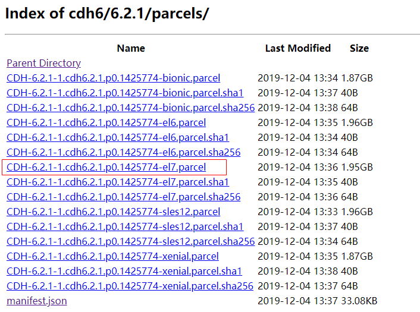

- 下载

```
wget https://archive.cloudera.com/cdh6/6.2.1/parcels/CDH-6.2.1-1.cdh6.2.1.p0.1425774-el7.parcel
```

下载慢的话参考上一步的解决办法，下载完成后将文件复制到`/opt/cloudera/parcel-repo`目录

- 复制到`/opt/cloudera/parcel-repo`目录

```
mkdir -p /opt/cloudera/parcel-repo
mv CDH-6.2.1-1.cdh6.2.1.p0.1425774-el7.parcel /opt/cloudera/parcel-repo/
```

- 生成`sha1`签名文件

```
sha1sum CDH-6.2.1-1.cdh6.2.1.p0.1425774-el7.parcel | awk '{ print $1 }' > CDH-6.2.1-1.cdh6.2.1.p0.1425774-el7.parcel.sha
```

- 修改目录所属用户

```
chown -R cloudera-scm:cloudera-scm /opt/cloudera/parcel-repo/*
```

- 目录最终如下

```
ls -l /opt/cloudera/parcel-repo/
-rw-r--r--. 1 cloudera-scm cloudera-scm 2093332003 4月   9 10:19 CDH-6.2.1-1.cdh6.2.1.p0.1425774-el7.parcel
-rw-r--r--. 1 cloudera-scm cloudera-scm         41 4月  16 16:26 CDH-6.2.1-1.cdh6.2.1.p0.1425774-el7.parcel.sha
```

### 启动 CM 服务

在`master`节点上运行以下命令：

```
systemctl start cloudera-scm-server
```

观察日志输出，当看到`Started Jetty server.`时表示服务已经启动成功了

```
tail -f /var/log/cloudera-scm-server/cloudera-scm-server.log
```


### 访问 CM 控制台

浏览器访问`http://master.cdh:7180`，账号密码统一为`admin`。


## 开始安装

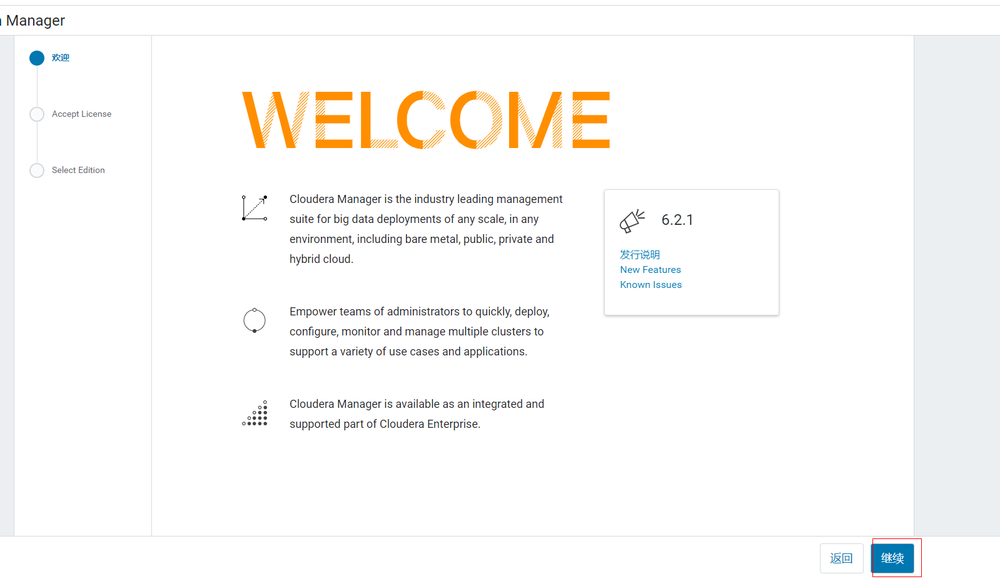
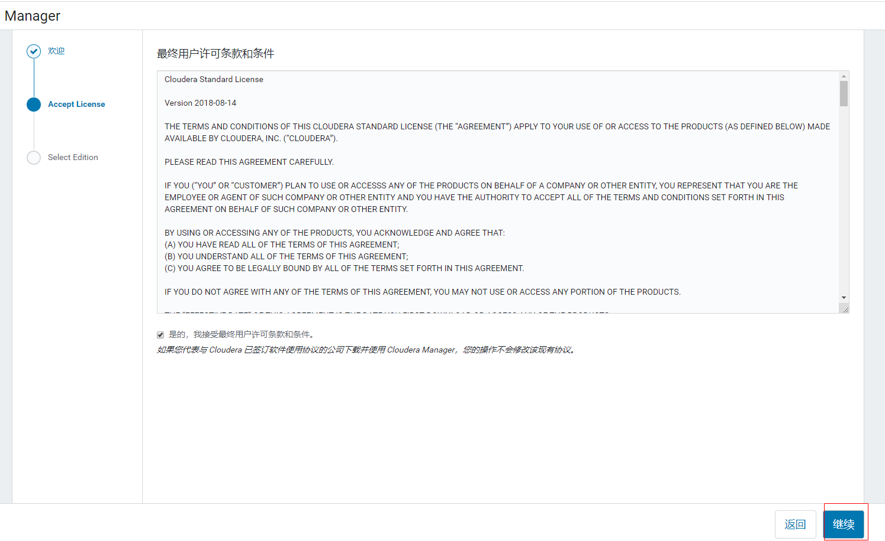

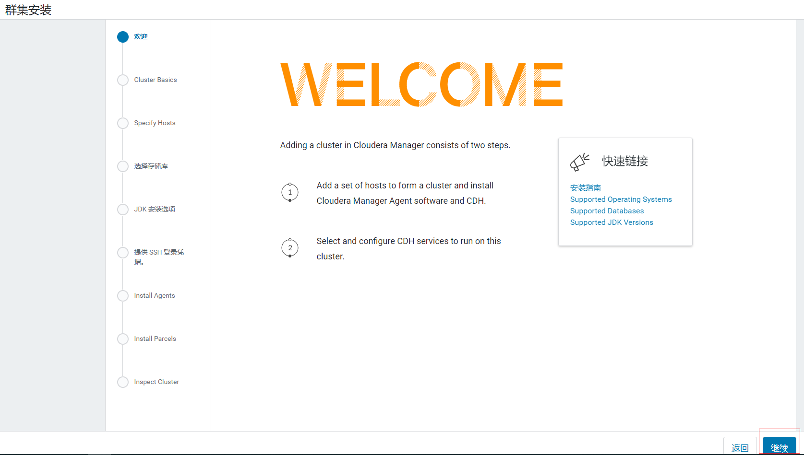

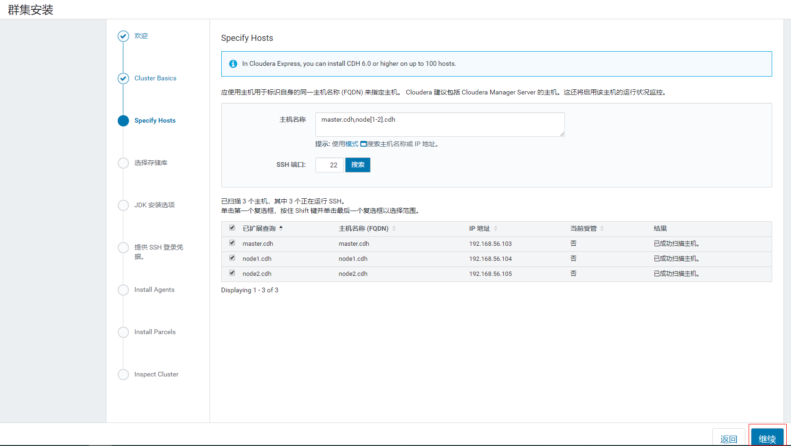
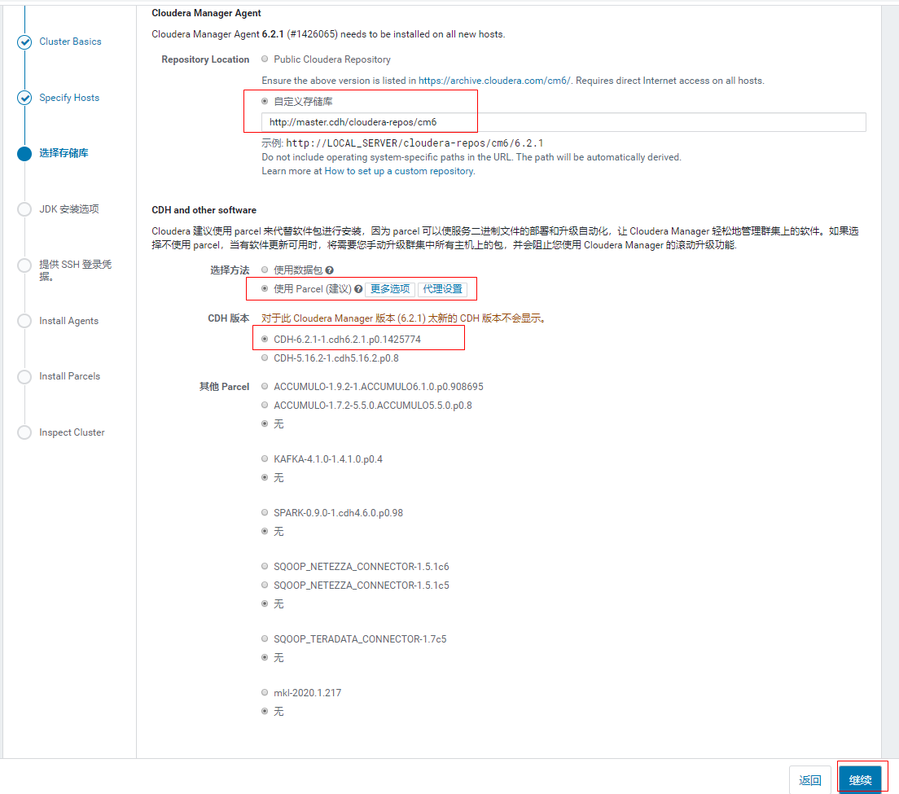
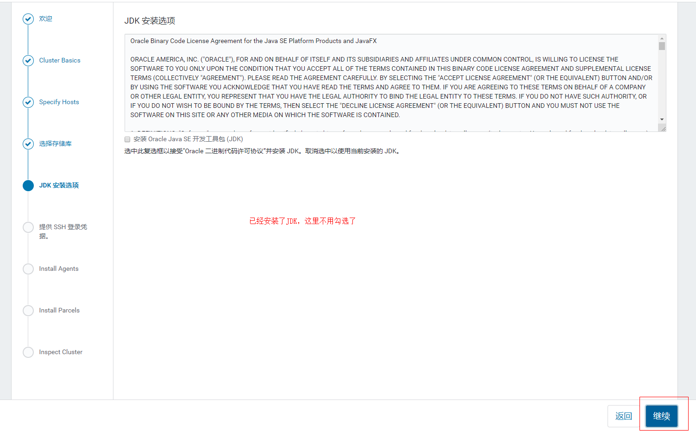
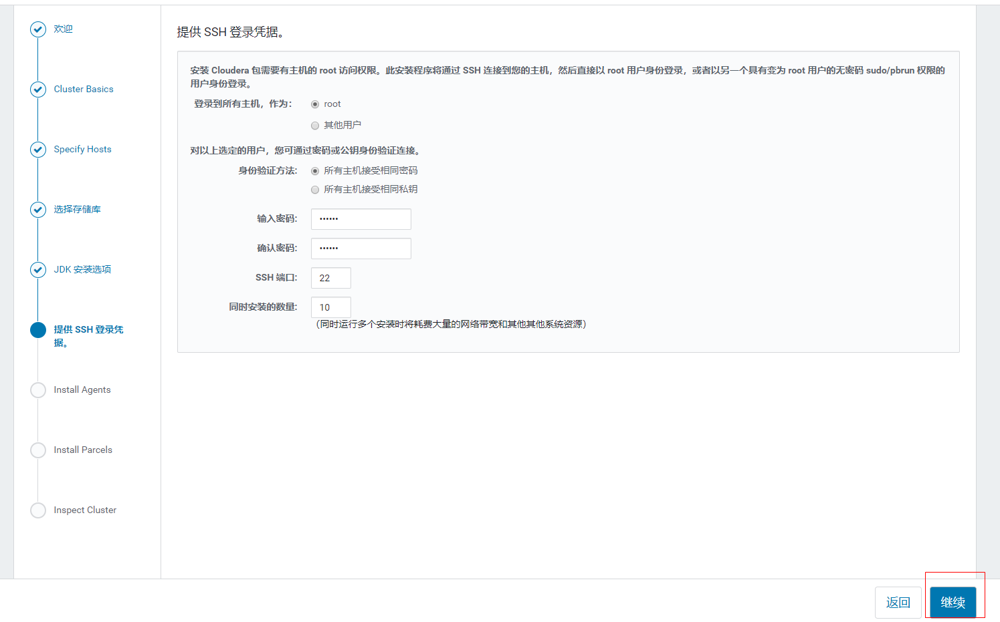
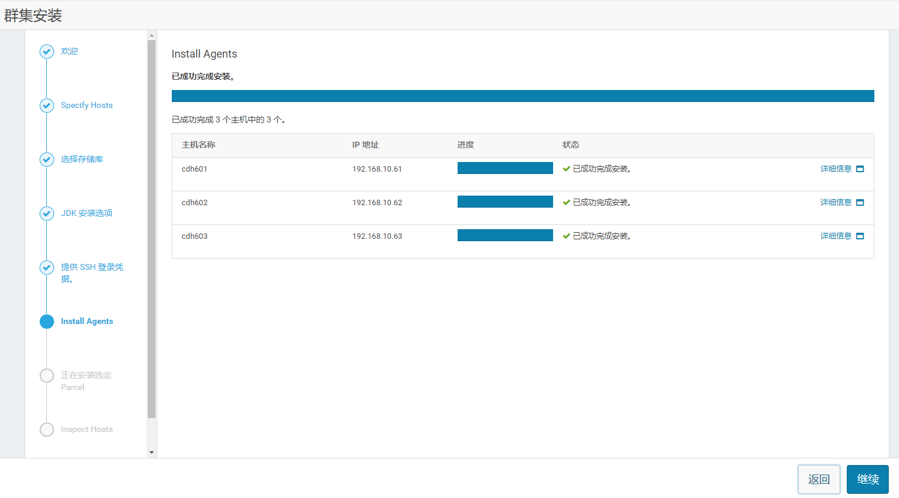
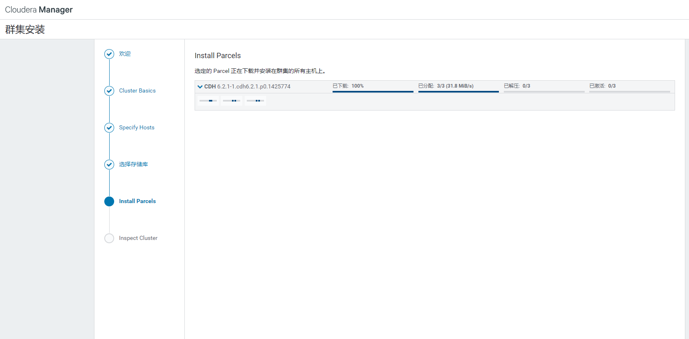
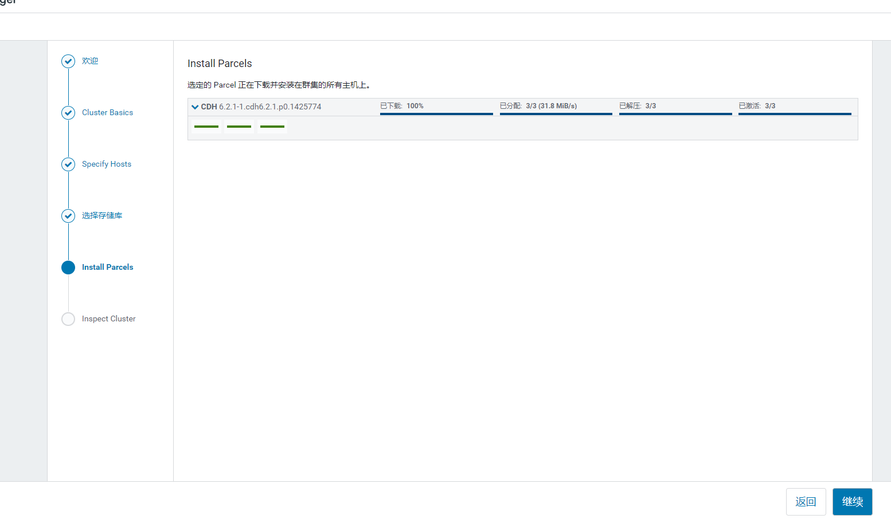
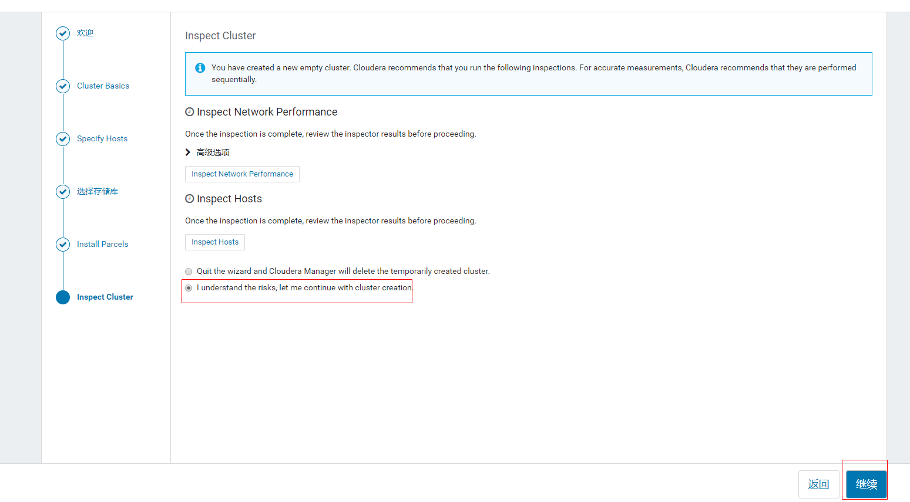
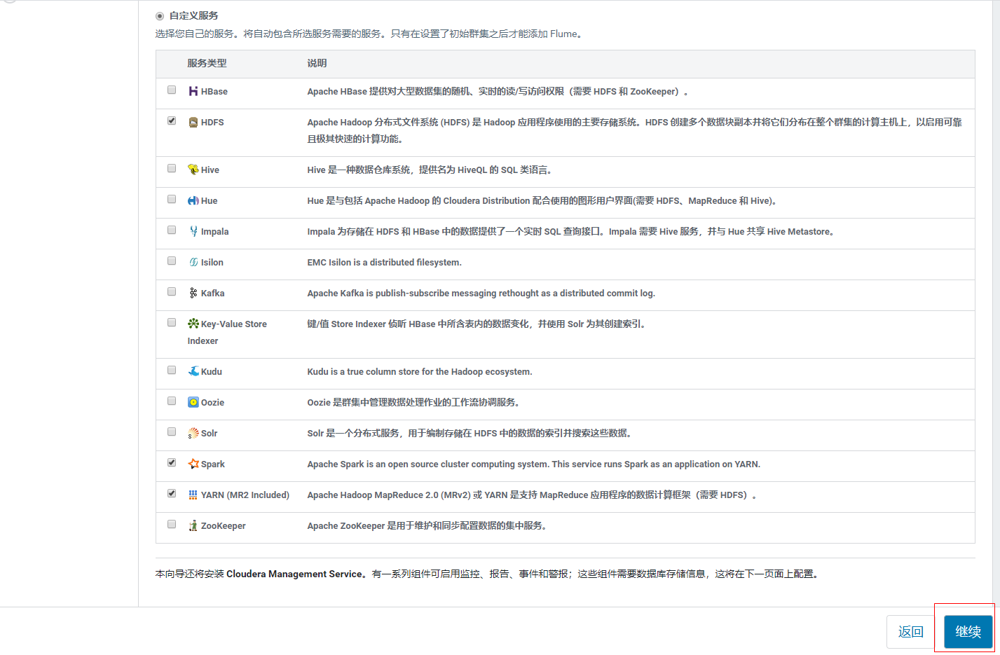
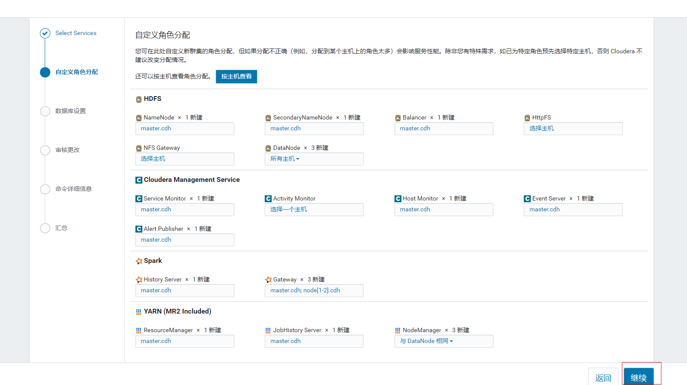


然后等到安装完成就行了，最终结果如下：

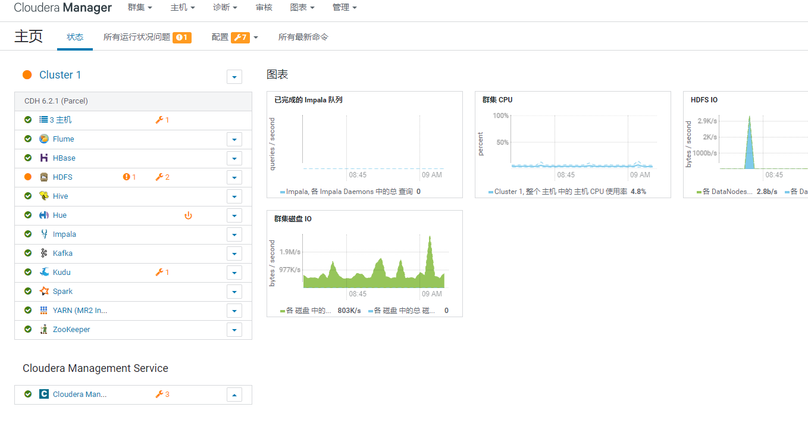