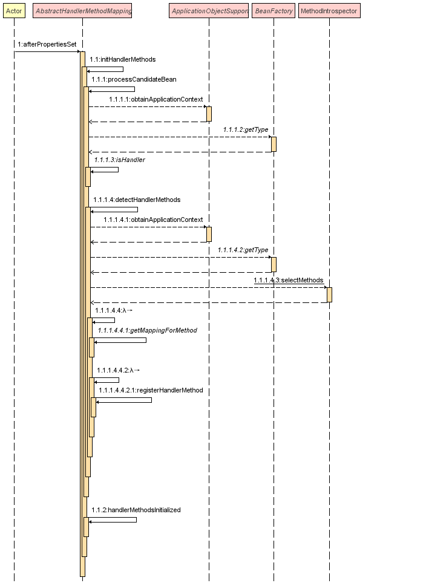
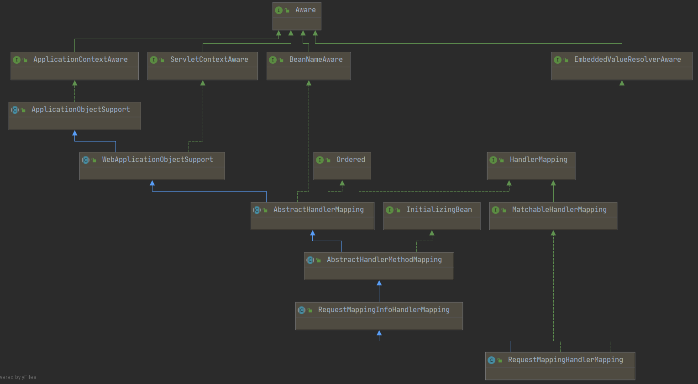

## RequestMappingHandlerMapping 介绍

`RequestMappingHandlerMapping`是`SpringMVC`中的一个重要组件，作用是扫描`@Controller`、`@RequestMapping`注解修饰的类，然后生成`请求`与`方法`的对应关系，当有一个 HTTP 请求进入 SpringMVC 时，就会通过请求找到对应的方法进行执行。

可以简单的想象一下，在`RequestMappingHandlerMapping`会维护一个`Map<String,Handle>`，key 存放的是`URI`，value 存放的是对应处理的`handle`，例如：

```
map.put("GET /user",UserController#get)
map.put("POST /user",UserController#create)
```

这样通过解析请求就可以很快的找到对应的方法去执行，当然 SpringMVC 的实现肯定不会像上面一样这么简单，不过思路是差不多的。

### 加载流程

- 流程图



1. `RequestMappingHandlerMapping`实现了`InitializingBean`接口，在应用启动时会触发`afterPropertiesSet`方法。
2. 在`initHandlerMethods`方法中，会遍历所有候选的 Bean，并通过`processCandidateBean`方法进行处理。

   - AbstractHandlerMethodMapping.java

   ```java
   protected void initHandlerMethods() {
       //遍历所有候选的Bean name
       for (String beanName : getCandidateBeanNames()) {
           if (!beanName.startsWith(SCOPED_TARGET_NAME_PREFIX)) {
               //处理Bean name
               processCandidateBean(beanName);
           }
       }
       handlerMethodsInitialized(getHandlerMethods());
   }
   ```

3. 在`processCandidateBean`方法中，会通过`isHandler`判断`Bean`是否为`@Controller`、`@RequestMapping`注解修饰的类，是的话调用`detectHandlerMethods`来检查类中的`Handler method`
4. `detectHandlerMethods`中会遍历类中所有方法，通过`getMappingForMethod`方法筛选出`@RequestMapping`注解修饰的方法，然后解析成`method`->`mapping`的 Map 结构存起来，再遍历使用`registerHandlerMethod`方法注册到 SpringMVC 中

   - AbstractHandlerMethodMapping.java

   ```java
   protected void detectHandlerMethods(Object handler) {
       Class<?> handlerType = (handler instanceof String ?
               obtainApplicationContext().getType((String) handler) : handler.getClass());

       if (handlerType != null) {
           Class<?> userType = ClassUtils.getUserClass(handlerType);
           //查询Class中的方法
           Map<Method, T> methods = MethodIntrospector.selectMethods(userType,
                   (MethodIntrospector.MetadataLookup<T>) method -> {
                       //通过匿名内部类的方式来进行method的过滤，没有通过@RequestMapping修饰的方法会返回null
                       try {
                           return getMappingForMethod(method, userType);
                       }
                       catch (Throwable ex) {
                           throw new IllegalStateException("Invalid mapping on handler class [" +
                                   userType.getName() + "]: " + method, ex);
                       }
                   });
           if (logger.isTraceEnabled()) {
               logger.trace(formatMappings(userType, methods));
           }
           //遍历methods进行注册
           methods.forEach((method, mapping) -> {
               Method invocableMethod = AopUtils.selectInvocableMethod(method, userType);
               registerHandlerMethod(handler, invocableMethod, mapping);
           });
       }
   }
   ```

   5. 通过`registerHandlerMethod`将对应的关系存放到`mappingRegistry`对象中，里面有很多的 Map 用于存储映射关系

   - AbstractHandlerMethodMapping.java

   ```java
   //封装HandlerMethod，实际上就是bean name+method，在拦截器中就是暴露的这个对象
   HandlerMethod handlerMethod = createHandlerMethod(handler, method);
   validateMethodMapping(handlerMethod, mapping);
   //将mapping对象和handlerMethod关系存放至mappingLookup
   this.mappingLookup.put(mapping, handlerMethod);

   List<String> directUrls = getDirectUrls(mapping);
   for (String url : directUrls) {
       //将非通配符形式的路径与mapping对象关系存放至urlLookup
       this.urlLookup.add(url, mapping);
   }

   String name = null;
   if (getNamingStrategy() != null) {
       name = getNamingStrategy().getName(handlerMethod, mapping);
       addMappingName(name, handlerMethod);
   }

   CorsConfiguration corsConfig = initCorsConfiguration(handler, method, mapping);
   if (corsConfig != null) {
       this.corsLookup.put(handlerMethod, corsConfig);
   }

   this.registry.put(mapping, new MappingRegistration<>(mapping, handlerMethod, directUrls, name));
   ```

   通过源码可以得知，目前有这两个`mappingLookup`和`urlLookup`对象存放了请求映射关系，在请求到来的时候就会通过这两个`Map`去寻找要执行的方法。

### 请求流程

先上一张 springMVC 流程图：


入口由`DispatcherServlet`统一接管，然后通过上一步生成好的`HandlerMapping`映射关系来查找请求对应的处理方法。

- DispatcherServlet.java

```java
// 寻找当前请求的处理方法
mappedHandler = getHandler(processedRequest);
if (mappedHandler == null) {
    noHandlerFound(processedRequest, response);
    return;
}
```

在`getHandler`方法中就是对应的逻辑了，代码如下：

```java
protected HandlerExecutionChain getHandler(HttpServletRequest request) throws Exception {
    if (this.handlerMappings != null) {
        //遍历handlerMappings,只要能根据请求匹配到一个handler就返回
        for (HandlerMapping mapping : this.handlerMappings) {
            HandlerExecutionChain handler = mapping.getHandler(request);
            if (handler != null) {
                return handler;
            }
        }
    }
    return null;
}
```

这里值得一提的是`handlerMappings`是一组`HandlerMapping`接口的实现，`SpringMVC`默认提供的是`org.springframework.web.servlet.mvc.method.annotation.RequestMappingHandlerMapping`，如果有需要我们也可以自定义一个`HandlerMapping`实现来处理请求。

接着一路跟踪源码，直到`AbstractHandlerMethodMapping#lookupHandlerMethod(String lookupPath, HttpServletRequest request)`方法，就可以看到具体的实现了。

- AbstractHandlerMethodMapping.java

```java
//先直接使用URI进行匹配，适用于没使用通配符修饰的接口路径，对应urlLookup
List<T> directPathMatches = this.mappingRegistry.getMappingsByUrl(lookupPath);
if (directPathMatches != null) {
    //路径匹配到之后，还要根据method、header、consume、produce等等条件继续进行匹配
    addMatchingMappings(directPathMatches, matches, request);
}
if (matches.isEmpty()) {
    //如果没匹配到，再通过通配符的方式去匹配，对应mappingLookup
    addMatchingMappings(this.mappingRegistry.getMappings().keySet(), matches, request);
}
```

至此与 RequestMappingHandlerMapping 有关的请求流程就已经介绍完了，最后再附上一张类图：



大部分的实现逻辑都在父类`AbstractHandlerMethodMapping`中。

## 自定义 RequestMappingHandlerMapping

终于步入主题了，在了解`RequestMappingHandlerMapping`的大概的原理之后，就很清楚的如何来魔改`RequestMappingHandlerMapping`。

### 需求

项目中有一个`BaseController`基础类，当有新的需求开发时只需要继承该类就会拥有对应的`CRUD`接口，例如：

- BaseController.java

```java
public class BaseController<T> {
    @PostMapping
    public Result<T> insert(@Validated @RequestBody T vo) {
        //...
    }

    @PutMapping("{id}")
    public Result<T> update(@PathVariable @NotNull String id, @RequestBody @Validated T vo) {
        //...
    }

    @DeleteMapping("{id}")
    public Result<T> delete(@PathVariable @NotNull String id) {
        //...
    }

    @GetMapping("{id}")
    public Result<T> get(@PathVariable @NotNull String id) {
        //...
    }
}

```

- AppController.java

```java
@RestController
@RequestMapping("/app")
public class AppController extends BaseController<App>{

}
```

这样`AppController`就拥有了基本的`CRUD`接口功能，但是在某些情况的时候我需要屏蔽掉某个接口，可以通过重写方法来实现：

- AppController.java

```java
@RestController
@RequestMapping("/app")
public class AppController extends BaseController<App>{

    //屏蔽get接口
    @Override
    @GetMapping("{id}")
    public Result<T> get(@PathVariable @NotNull String id) {
        throw new UnsupportedOperationException();
    }
}
```

这样实现其实也没啥问题，不过会占用一个路由，如果想重写这个接口，并且返回不同的响应体，就实现不了了，例如：

- 重写父类方法编译不通过，因为泛型不兼容`Result<App>!=Result<AppDetailDTO>`

```java
//返回特殊的AppDetailDTO
@Override
@GetMapping("{id}")
public Result<AppDetailDTO> get(@PathVariable @NotNull String id) {
    //...
}
```

- 屏蔽父类接口，并声明一个新的方法来实现

```java
//屏蔽get接口
@Override
@GetMapping("{id}")
public Result<T> get(@PathVariable @NotNull String id) {
    throw new UnsupportedOperationException();
}

//声明一个新方法来实现
@GetMapping("/detail/{id}")
public Result<AppDetailDTO> getDetail(@PathVariable @NotNull String id) {
    //...
}
```

通过重新定义一个新的`路由`来实现，虽然说可以达到目的，但是感觉不够优雅，`/{id}`路由白白就浪费了，这个时候就只能通过自定义`RequestMappingHandlerMapping`来实现了。

### 思路

通过上面的分析可以得知，在应用启动时`RequestMappingHandlerMapping`会去扫描所有的`handle`进行关系映射，可不可以实现一个注解，在扫描某个方法时，如果有该注解修饰的时候就跳过。

根据源码可以得知`getMappingForMethod`，是扫描`method`的处理入口，方法签名如下：

```java
protected RequestMappingInfo getMappingForMethod(Method method, Class<?> handlerType)
```

这个方法可以拿到`Method`，只有重写该方法并且判断`Method`上有自定义的注解修饰直接返回 null 就可以达到取消路由注册的目的了。

### 实现

定义一个`@Disable`注解，用于标识方法不进行路由注册：

```java
@Target(ElementType.METHOD)
@Retention(RetentionPolicy.RUNTIME)
@Documented
public @interface Disable {
}
```

通过实现`WebMvcRegistrations`接口来自定义`RequestMappingHandlerMapping`类，并重写`getMappingForMethod`方法：

```java
@Configuration
@ConditionalOnWebApplication
public class WebAutoConfiguration implements WebMvcRegistrations {

    @Override
    public RequestMappingHandlerMapping getRequestMappingHandlerMapping() {
        return new RequestMappingHandlerMapping() {
            @Override
            @Nullable
            protected RequestMappingInfo getMappingForMethod(Method method, Class<?> handlerType) {
                //如果方法上有@Disable注解，直接返回null
                if (AnnotationUtils.findAnnotation(method, Disable.class) != null) {
                    return null;
                }
                //否则还是按照以前的逻辑进行处理
                return super.getMappingForMethod(method, handlerType);
            }
        };
    }

}
```

这样之前的需求就可以解决了：

```java
//屏蔽get接口
@Disable
@Override
@GetMapping("{id}")
public Result<T> get(@PathVariable @NotNull String id) {
    throw new UnsupportedOperationException();
}

//声明一个新方法来实现，并且路由不变
@GetMapping("{id}")
public Result<AppDetailDTO> getDetail(@PathVariable @NotNull String id) {
    //...
}
```

父类的方法用`@Disable`注解修饰了，SpringMVC 并不会加载这个路由，在项目重启的时候就不会报错提示有两个相同的路由存在。

## 总结

不要为了看源码而看源码，而是带着问题去看框架的源码才是有意义的。
