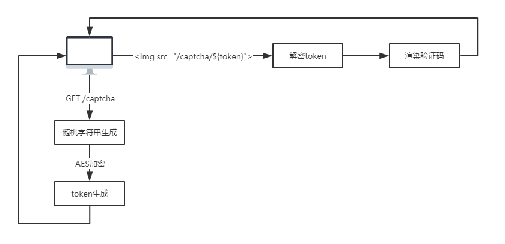
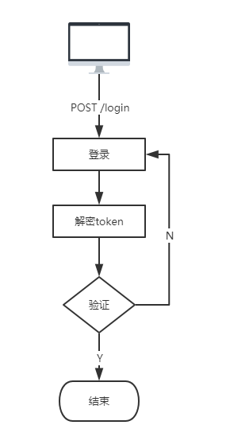

## 背景

通常验证码都是通过`session`来实现，在服务端生成一个随机字符串作为验证码，将该字符串存到`session`中，然后将验证码图片渲染到前端，前端提交之后通过`session`中存放的正确验证码进行对比从而验证输入的正确性。

上面是一个典型的验证码实现的流程，但是这种方案存在非常多的弊端，例如：

1. 分布式应用：大家知道`session`是有状态的，当服务器存在多个时，需要去处理`session`丢失的问题。
2. 跨域问题：现在前后端分离大行其道，`cookie`跨域问题会导致`session id`无法正确传递，需要去处理`cookie`跨域的问题。
3. 开销问题：维护`session`需要消耗一定服务器的资源。

<!-- more -->

## 无状态验证码

为了解决上面的问题，我想了一个解决方案，核心思想是将`真实的验证码字符串`存储在前端，当然是经过`加密`的字符串，流程图如下：



1. 首先前端通过接口获取一个`token`
2. 服务端生成`随机字符串`并通过`AES`加密，`AES KEY`放在服务器保证加密解密是安全的
3. 客户端通过`token`访问一个验证码图片
4. 服务器通过`AES`解密拿到之前生成的`随机字符串`，然后将字符串渲染成图片返回

至此前端已经得到了一个`token`和一个`验证码图片`，后续的流程图如下：


1. 前端发起登录请求，将`token`和用户输入的`验证码`一起发送到后端。
2. 服务器通过`AES`解密拿到之前生成的`随机字符串`，再和用户输入的`验证码`做对比校验

这样就实现了一个无状态的验证码。

## 安全性

上面的验证码存在`重放攻击`的风险，即记录一次正确的`token`和`输入的验证码`，这样就可以一直使用，以此绕过验证码校验。对此可以在`token`中加入`过期时间`属性，这样`token`中其实包含了加密后的`正确验证码`和`过期时间`，在经过服务器时，首先通过时间检验，这样就可以大大的避免`重放攻击`的风险。

## 实现

这里后端主要是用`springboot`+`hutool`来实现，`hutool`用于验证码图片的渲染。

- 后端

```java
@ApiOperation(value = "获取验证码token", httpMethod = "GET")
@GetMapping("captcha")
public Result<String> getCaptcha() {
    // 随机生成4位字符串
    String code = RandomUtil.randomString(4);
    // 封装字符串和过期时间
    CaptchaDTO dto = new CaptchaDTO();
    dto.setCode(code);
    // 过期时间为一分钟
    dto.setExp(System.currentTimeMillis() + TimeUnit.MINUTES.toMillis(1));
    // CAPTCHA_AES_KEY为AES加密中用到的key，存储在服务器中
    // 将dto对象转化成json字符串，再通过aes加密
    // token=aes(key,JSON.toString(dto))
    String token = SecureUtil.aes(Base64.getDecoder().decode(CAPTCHA_AES_KEY)).encryptBase64(JSON.toJSONString(dto));
    return new Result<>(token);
}

@ApiOperation(value = "渲染验证码", httpMethod = "GET")
@GetMapping("captcha/{token}")
public void showCaptcha(@PathVariable String token, HttpServletResponse response) throws Exception {
    //解码token
    CaptchaDTO dto = decodeCaptcha(token);
    LineCaptcha lineCaptcha = CaptchaUtil.createLineCaptcha(100, 40, 4, 50);
    //渲染验证码
    lineCaptcha.createImage(dto.getCode());
    response.setContentType("image/png");
    lineCaptcha.write(response.getOutputStream());
}

@ApiOperation(value = "登录", httpMethod = "POST")
@PostMapping("login")
public Result<UserDTO> login(@RequestBody LoginVO loginVO) throws Exception {
    CaptchaDTO dto;
    try {
        //解码token
        dto = decodeCaptcha(loginVO.getToken());
    } catch (Exception e) {
        throw new BizException("验证码数据异常");
    }
    // 校验时间和验证码输入
    if (System.currentTimeMillis() > dto.getExp()
            || StrUtil.isBlank(loginVO.getCode())
            || !dto.getCode().equalsIgnoreCase(loginVO.getCode())) {
        throw new BizException("验证码校验不通过");
    }
    // 处理登录逻辑
    UserDTO user = userService.login(loginVO);
    return new Result<>(user);
}

 private CaptchaDTO decodeCaptcha(String token) throws UnsupportedEncodingException {
    // 解码token，注意要做一次url decode，因为前端通过url传递时需要做url encode
    String jsonStr = SecureUtil.aes(Base64.getDecoder().decode(CAPTCHA_AES_KEY)).decryptStrFromBase64(URLDecoder.decode(token, "UTF-8"));
    return JSON.parseObject(jsonStr, CaptchaDTO.class);
}
```

- 前端

```js
export default {
  name: "Login",
  data: () => {
    return {
      loginForm: { username: "", password: "", token: "", code: "" },
      captchaUrl: ""
    };
  },
  mounted() {
    this.getCaptcha();
  },
  methods: {
    //加载验证码
    async getCaptcha() {
      //获取验证码token
      this.loginForm.token = encodeURIComponent(await getCaptcha());
      //这里其实对token做了两次encodeURIComponent，因为img标签的get请求浏览器默认会做一次decode，不做两次encode会请求失败
      this.captchaUrl = `${api}/manager/users/captcha/${encodeURIComponent(
        this.loginForm.token
      )}`;
    },
    async login() {
      const result = await login(this.loginForm);
      //登录后处理...
    }
  }
};
```

## 后记

虽然在 `token` 中加入了一分钟的过期时间，但是在这一分钟内其实够干很多事了，比如注册的业务使用这种验证码方式，一分钟内可以模拟大量的请求来进行注册，所以无状态验证码方案并不适合所有的业务场景，还是需要根据业务情况来进行实施。
